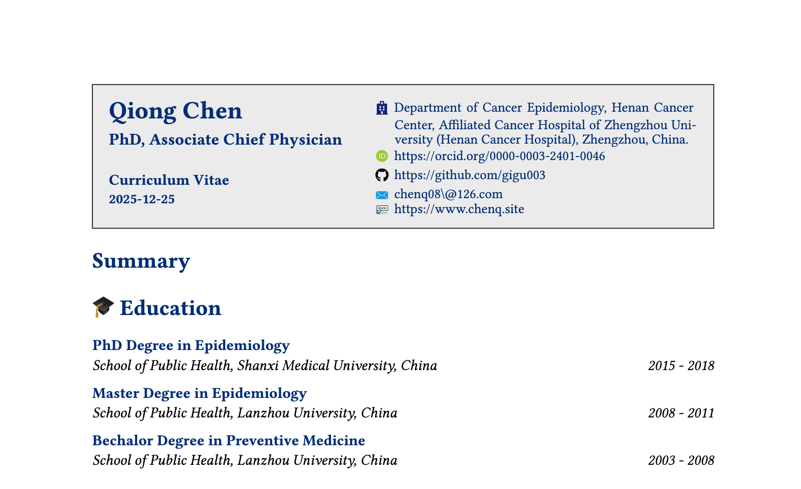

# Quarto qcv-typst Format

`qcv-typst` is a quarto typst format used to format a curriculum vitae, which is inspired by the [Rob J Hyndman](https://cdn.jsdelivr.net/gh/robjhyndman/CV@main/RobHyndmanCV.pdf).



## Installing

If you would like to add the clean theme to an existing directory:

``` bash
quarto install extension gigu003/typst-templates/qcv
```

or you can use a Quarto template that bundles a .qmd starter file:

``` bash
quarto use template gigu003/typst-templates/qcv
```

This will install the format extension and create an example qmd file that you can use as a starting place for your document.

## Using

The following typst code will create a block with title, description, and time period.

``` typst
#align_left_right("Attending Physician (Cancer Epidemiology)", "Henan Cancer Center / Henan Cancer Hospital", "2014 - 2021")
```

The following code generates a bibliography based on the specified BibTeX and CSL files. You can also include multiple bibliography blocks within the same document.

``` typst
#bibliographyx(("refs2.bib"), full: true, title: none, style: "apa2.csl", prefix: "x:")
```